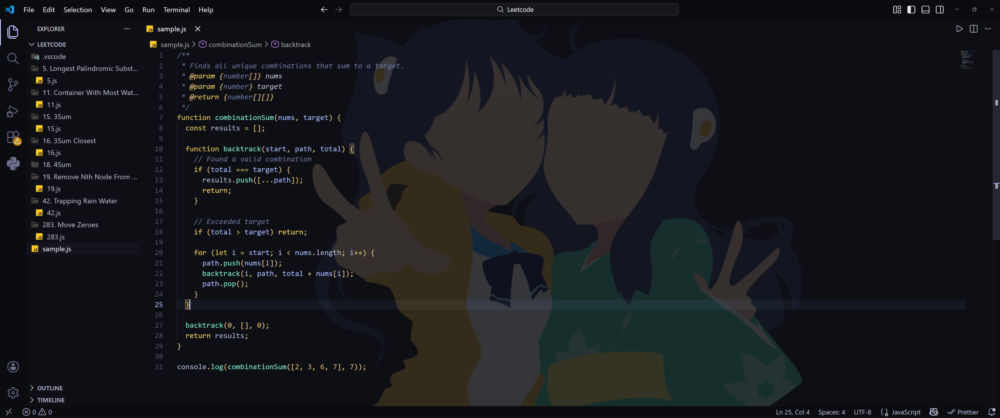

# Fire Sisters VSCode Color Theme
*A custom VS Code theme inspired by anime aesthetics of the "Fire Sisters" from the Monogatari series designed for long coding sessions.*



---

## Features

- Carefully crafted dark color palette  
- High readability for algorithms & long sessions  
- Soft yellow bracket highlights for structural clarity  
- Cool blue accents for selections & interactions  
- Balanced syntax hierarchy (keywords, functions, variables, comments)  
- Optimized contrast for JS, TS, Python, and general programming  
- Optional matching wallpaper included (see instructions below)

---

## Installation

Download the latest `.vsix` file from the **Releases** section

### Installing the VSIX

1. Open VS Code  
2. Press `Ctrl + Shift + P`  
3. Choose: **Extensions: Install from VSIX…**  
4. Select the downloaded `.vsix` file  
5. Reload VS Code  
6. Open the command palette again and choose:  
   - **Preferences: Color Theme**  
   - Select **Your Theme Name**

Done!

---

### Optional: Apply the Included Wallpaper (Using “Background” by shalldie)

This theme includes a matching wallpaper (`./wallpaper.png`) that you can use as your VS Code background through the **Background / Wallpaper** extension by shalldie.

### Install the extension

**Background (Wallpaper)**  
https://marketplace.visualstudio.com/items?itemName=shalldie.background

---

## How to Add the Wallpaper

1. Install the extension above  
2. Open VS Code  
3. Press `Ctrl + Shift + P`  
4. Select **Open User Settings (JSON)**  
5. Add (or edit) the following:

```json
"background.enabled": true,
"background.useDefault": false,
"background.fullscreen": {
  "image": "/absolute/path/to/wallpaper.png",
  "opacity": 0.15,
  "size": "cover",
  "position": "center"
}
```

### Recommended Settings

These optional VS Code settings pair well with this theme:

```json
{
  "editor.bracketPairColorization.enabled": true,
  "editor.guides.bracketPairs": "active",
  "editor.cursorBlinking": "smooth",
  "editor.renderWhitespace": "selection",
  "workbench.tree.indent": 16
}
```

